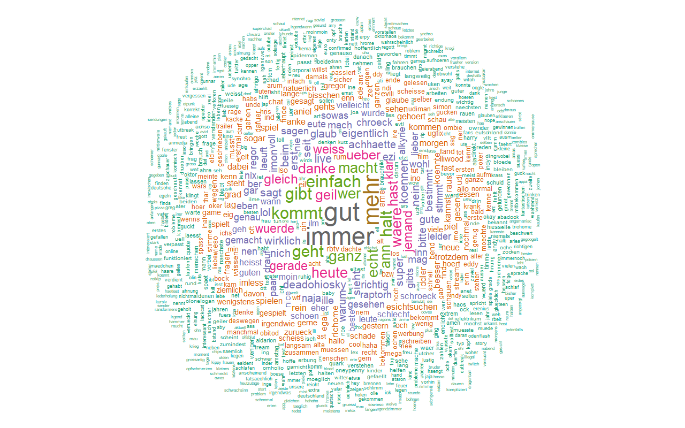
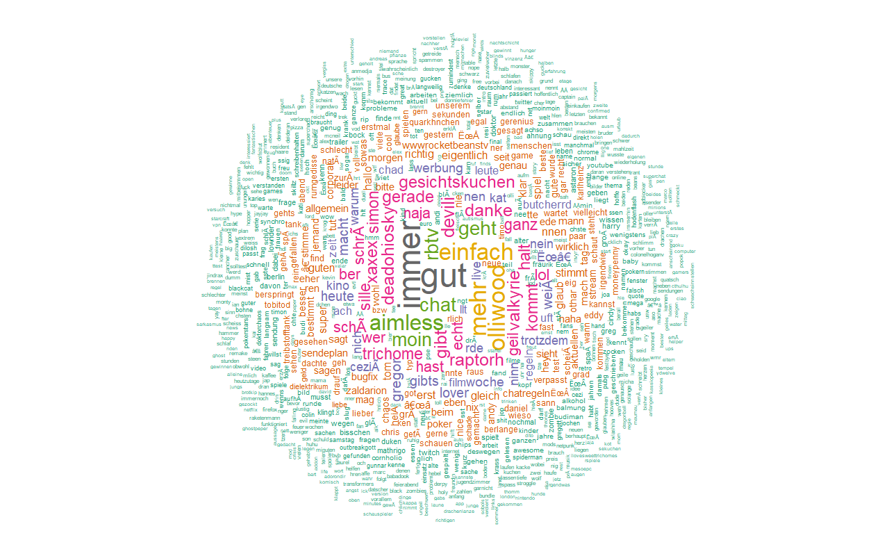

```{r setup, include=FALSE}
knitr::opts_chunk$set(echo = TRUE)
```
```{r, echo=FALSE,warning=FALSE, message=FALSE}
library(readr)
library(ggplot2)
numberOfChats <- read_csv("C:/Clouds/OwnCloud/Projekte/R/Rocketbeans - Chat/Rocketbeans Chat/files/numberOfChats.csv")
```

\newpage
# Aufwärmrunde

## Falls ihr es nicht wusstet

Falls ihr es nicht wusstet, aber Daten werden immer wichtiger für moderne Unternehmen. Ich weiß nicht, wie sehr ihr euch mit dem Thema auseinander gesagt habt, jedoch möchte ich euch gerne einen kleinen Report/Analyse bezüglich euren Chat liefern.

Aber erstmal, wieso sind Daten überhaupt wichtig? Stell dir vor du stehst vor einen 3-4m hoch hängenden Klavier, das gerade aufgehangen wurde. Würdest du unter dem Klavier auf die andere Seite laufen? Jetzt stell dir vor das Klavier hängt bereits mehrere Jahre an dieser Stelle und ist Witterungen ausgesetzt. Würdest du nun unter dem Klavier durch laufen? Deine Entscheidung wird also auf Basis von den gegebenen Daten gefällt. Genau diese Informationen schlummern teilweise offentsichtlich in den Daten und oftmals auch versteckt in einer Ecke.

Weiterhin ist das Verständnis über die Daten des eigenen Unternehmens extrem wichtig. Das heißt, je mehr \textbf{ihr} über eure Daten lernt, desto besser ist das Verständnis über euer Business.

## Bevor ihr euch jetzt fragt

Bevor ihr euch jetzt fragt, wieso ich den ganzen Aufwand betrieben habe um einige wenige Informationen versucht habe zu gewinnen, möchte ich kurz auf meinem Hintergrund hinweisen.

Mein Name ist Bernhrd Preisler (29) und studiere an der Hochschule Darmstadt im Fachbereich Mathematik den Studiengang \textbf{Data Science}. Der Studiengang zielt darauf ab sich mit der gängigen Umsetzungen von daten-bezogenen Projekten aus der Informatiker-Sicht sich zu beschäftigen und außerdem eine Menge über diese Daten aus der mathematischen Sichtweise zu lernen. Nun steht mein drittes von vier Mastersemester bevor und ich suche solangsam eine Masterthesis für das vierte Semester. Meine Idee wäre jetzt, dass ich euch diese kleine Analyse zusammenfasse und falls euch das gesamte Thema allgemein zusagt, sich zusammen an einem Tisch setzt und vielleicht gemeinsam ein Thema findet.

\newpage
# Analyse

## Einführung

Die ursprüngliche Idee war ein wenig den Chat zu analysieren. Hierbei habe ich [die Daten Github](https://github.com/ScheduleTracker/RBTVChatLogs) verwendet. Dafür habe ich ein Skript geschrieben, welches die Anzahl der Zeilen pro Daten ausließt und den dazugehörigen Wochenname dazu anreichert. Dieses Script wurde in PHP geschrieben. Die obersten 6 Zeilen der Daten sehen wie folgt aus.
```{r, echo=FALSE}
head(numberOfChats)
```
Wie in der obigen Ausgabe zu sehen ist, enthält unser Datensatz 3 Spalten mit Datum, Anzahl der Nachrichten im Chat und der Wochenname. Weitere Information erhalten wir in der nächsten Ausgabe.
```{r, echo=FALSE}
summary(numberOfChats)
```
Die obigen Ausgabe lehrt, dass der Datensatz in einer Zeitspanne vom 07.09.2016 bis 23.07.2017 Daten enthält. Außerdem ist die Reichweite der Anzahl der Nachrichten im Chat pro Tag irgendwas zwischen 5284 und 64151 mit einem Median von 16770. Da der Median viel näher an der unteren Grenze liegt, kann mit hohen abweichenden Daten gerechnet werden (Ausreißer).


## Normalverteilung

Als aller erstes überprüfen wir, ob die gegbeenen Daten normalverteilt sind. Falls diese Daten normalverteilt sind, besteht die Möglichkeit einfache Verfahren zu benutzen, um herauszufinden, ob ein Monat besser war als z.B. der vorrige. Hierbei wird jetzt davon ausgegangen, dass je größer die Aktivität im Chat war, desto besser waren die Shows. (Bzw. interaktiver)

### Wieso eine Prüfung auf Normalverteilung?

Wenn wir wissen, ob unsere Daten normalverteilt sind, können wir einfach statistische Tests durchführen.

Z.B. kann die Frage beantwortet werden, ob der Chat sich positiv entwickelt. (Wenn wir davon ausgehen, dass mehr Nachrichten eine positive Entwicklung ist)

Fällt die Prüfung negativ aus, müssen nicht-parametrische Methoden angewendet werden. Dazu muss man wissen, dass man eine Normalverteilung durch Parameter (Erwartungswert und Varianz) beschreiben kann. Wird festgestellt, dass keine Normalverteilung vorliegt, wissen wir auch keine Paramter über die Verteilung unserer Daten.

Eine Normalverteilung wird also durch zwei Parameter beschrieben den Erwartungswert und die Varianz. Der Erwartungswert beschreibt die Lage der Verteilung und die Varianz die Streuung. In der unteren Abbildung ist der Erwartungswert 0 und die Varianz 1.

```{r, echo=FALSE}
rn <- rnorm(100000)
df <- data.frame(x = rn)
ggplot(df, aes(x=x)) + geom_density()
```

### Boxplot

Das erste Werkzeug für die Überprüfung auf Normalverteiltheit ist der Boxplot.

```{r, echo=FALSE}
boxplot(numberOfChats$`Number of Chats`)
```

Wären die Daten normalverteilt, wäre dieser Boxplot symetrisch. Im oberen Teil des Boxplottes sind Kreise zu sehen, die die Ausreiser bestätigen. Dies spricht alles gegen Normalverteiltheit.

### Histogramm

Das Histogramm ist ebenfalls ein Mittel, um die Normalverteiltheit zu prüfen. Außerdem wird hier besser visualisiert, wo sich die meisten Daten befinden.

```{r, echo=FALSE, message=FALSE}
ggplot(data=numberOfChats, aes(numberOfChats$`Number of Chats`)) + geom_histogram() + 
  labs(title = "Histogram über die Anzahl der Chatnachrichten",
       x = "Anzahl der Nachrichten",
       y = "Anzahl")
```

An dieser Stelle wird ebenfalls bestätigt, dass die gegebenen Daten aus mehreren Ausreißern besteht und nicht normalverteilt ist.

### QQPlot

Der absolute Todesstoß für die Normalverteilung liedert der QQPlot. Hierbei sollten die Punkte bei einer Normalverteilung sich weitestgehend auf der Geraden befinden.

```{r, echo=FALSE}
qqnorm(numberOfChats$`Number of Chats`); qqline(numberOfChats$`Number of Chats`)
```


## Weitere explorative Analysen

### Dot-Plot
Da wir festgestellt haben, dass die Daten nicht normalverteilt sind, können wir die ganzen schönen Methoden bezüglich der Normalverteilung nicht verwenden. Deswegen versuchen wir auf anderem Wege mehr über die Daten zu lernen.

Als nächstes betrachten wir immer noch die Anzahl der täglich geschriebnen Nachrichten pro Tag in einem Dot-Plot.
```{r, echo=FALSE}
ggplot(data = numberOfChats, aes(x = Date, y = `Number of Chats`)) + geom_point() + geom_smooth() + 
  labs(title = "Anzahl der Chatnachrichten über dem gesamten Zeitraum",
       x = "Zeitreichweite",
       y = "Anzahl der Chatnachrichten")
```

Am Anfang und am Ende der Linie geht der graue Bereich (Konfidenzintervallgrenzen) außeinander. Da diese Linie nichts Vorhersagen kann, geht dieser Intervall in die Breite. D.h. eigentlich nur, dass ab dem Zeitpunkt außerhalb des Chartes keine Aussage getroffen werden kann.

Wie zu stehen ist, kann ein leichter Abwertstrend zu verzeichnet werden. Interessant sind die Ausreiser über 40.000 Nachrichten pro Tag, die eine hohe Chatbeteiligung beinhalten. Nun lassen wir uns mal die Daten ausgeben.
```{r, echo=FALSE}
numberOfChats[numberOfChats$`Number of Chats` > 40000,]
```
16.09.2016 war ein Freitag und dort lief Beans vs. Donkey Kong.

07.10.2016 war ein Freitag und dort lief B.E.A.R.D.S.

28.10.2016 war ein Freitag und dort lief Skyrim.

18.11.2016 war ein Freiatg und dort lief GameTwo #1.

...

### Einzelne Wochentage

Da wir nun festgestellt haben, dass ein leichte aber linearen Abwertstrend existiert, können wir uns im folgenden Chart die einzelnen Wochentage nochmal genauer betrachten.

```{r, echo=FALSE, warning=FALSE, message=FALSE}
ggplot(data = numberOfChats, aes(x = Date, y = `Number of Chats`)) + geom_point() + geom_smooth() + facet_grid(. ~ Weekname) + 
  labs(title = "Anzahl der Chatnachrichten über dem gesamten Zeitraum pro Tag",
       x = "Zeitreichweite pro Tag",
       y = "Anzahl der Chatnachrichten")
```

Zu sehen ist ein drastischer Rückgang am \textbf{Freitag}, \textbf{Donnerstag} und am \textbf{Dienstag}. Der Freitag ist sehr auffällig, da die Intervallgrenzen dort sehr ausschlagen. Das heißt die Anzahl der Chatnachrichten variieren zwischen niedrig und sehr hoch. \textbf{Samstag} ist am stabilsten und hat sogar einen leichten Trend nach oben. Der \textbf{Mittwoch} scheint stabil zu sein.


# Ausblick

## Kleine Ausrede

Natürlich ist diese kleine explorative Datenanalyse nicht perfekt und die Prüfung auf Normalverteilung ist eigentlich quatsch. (Ich hatte das kleine Dokument vor ein paar Monaten angefangen und bin jetzt erst wieder dazu gekommen. Jetzt weiß ich aber nicht mehr, was ich mit der Normalverteilung anfangen wollte.)

## Anreicherung der Daten (Modell erstellen)

Weiterhin besteht die Möglichkeit den Datensatz mit weiteren Daten anzureichern. z.B. könnte man hinzufügen

* Formate, die an diesem Tag liefen,
* Personen, die an diesem Tag vor der Kamera waren,
* Die Zeit, wo ihr Live gestreamt habt oder
* Die Zeit, wo ihr VOD gestreamt habt.

Und bestimmt besteht die Möglichkeit noch weitere Information den Datensatz hinzuzufügen.

## Textmining

Außerdem wäre es interessant ein Sentimentindex über den Chat zu bilden. Was ist das? Zum Beispiel bestünde die Möglichkeit einen Trend im Chat zu ermitteln. Ist der Chat gerade positiv oder negativ gestimmt? Wenn solch ein Index existiert könnte dies unteranderem Live eingebunden werden oder als Feedback für die Moderatoren genommen werden, wenn sie gerade etwas total falsch machen.

Weiterhin habe ich noch zwei WordClouds vom 13.07.2016 und 14.07.2016 erstellt.

\textbf{13.07.2017}



\textbf{14.07.2017}

